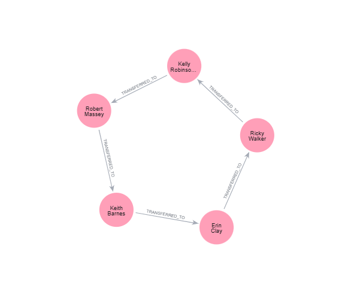
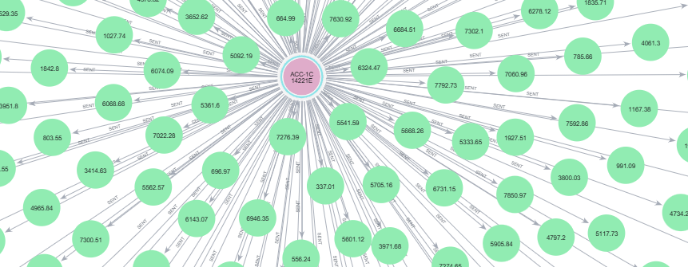
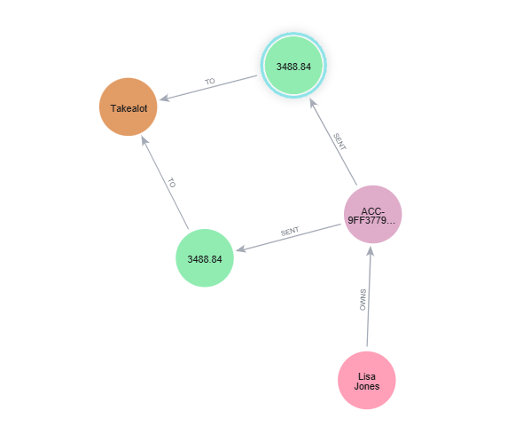

# 🏦 Financial Risk Engine: Autonomous Graph-Based Fraud Detection
### Neo4j AuraDB · GitHub Actions · Python · AI · South African Banking Context

---

## 📖 Project Overview:

In the modern banking sector, traditional SQL (relational) databases struggle to efficiently detect complex, multi-hop fraud patterns. Financial criminals use intricate networks of accounts to launder money, which requires expensive and painfully slow `JOIN` operations in a standard banking database. 

This project was built to demonstrate **commercial awareness of South African retail banking risk scenarios** (such as FICA AML compliance and FSCA incident response) and to solve the multi-hop fraud problem using a **Graph Database (Neo4j)**. By modeling accounts, customers, and transactions as *nodes* and *relationships*, the engine traverses complex financial networks in milliseconds—exposing patterns that are virtually invisible to flat-table queries.

Furthermore, this engine operates as a fully autonomous cloud microservice. It continually streams synthetic South African payment traffic, detects anomalies in real-time, and dispatches rich HTML email alerts to bank risk analysts with direct "deep links" to investigate the graph visually.

---

## 🚀 Core Functionalities

### 1. Continuous Live Transaction Streaming
The engine simulates a live retail banking payment network, streaming organic traffic (groceries, fuel, e-commerce) while periodically injecting malicious anomalies. 
* Managed by GitHub Actions on a persistent cron schedule.
* Prevents database overflow via intelligent conditional cleanup limits (wipes old nodes only when approaching Neo4j's free-tier limit).

### 2. AML Smurfing Ring Detection
Detects closed-loop, circular money transfers used to bypass FICA reporting thresholds (e.g., Person A → B → C → D → A).
* Scans for 2 to 10 hop traversals.
* **Evidence:** See the visualization below for how the engine maps the circular flow of laundered ZAR between syndicate members.

### 3. AML Structuring Detection
Detects individuals making rapid, multiple transfers just below the R5,000 FICA reporting threshold to avoid raising automated bank flags.
* **Evidence:** See the graph mapping below of high-frequency, low-value outgoing transactions designed to evade detection.

### 4. Payment Gateway Glitch Detection (The FNB / Takealot Incident)
Mathematically replicates a real-world South African banking incident: the well-documented FNB (First National Bank) virtual card glitch. During this incident, the bank's gateway erroneously fired duplicate and triplicate charges against merchants like Takealot due to retry-logic errors.
* Uses temporal windowing to detect exact duplicate amounts charged to the same merchant within a 6-hour window.
* **Evidence:** See the graph rendering below of original vs. ghost charges hitting the merchant node.

### 5. Automated Intelligence Reporting & Alerting
Generates comprehensive, standalone HTML reports and emails them directly to banking stakeholders. 
* Calculates total **AML Exposure** and exact **Refunds Due** per merchant to assist with rapid incident response.
* Includes **"📋 Auto-Copy & View"** buttons that automatically copy the exact Cypher query and open the Neo4j Browser to visually inspect the specific anomaly.
* **Evidence:** [Download / View the Sample Risk Report Here](./risk_report_sample.html)

---

## 📂 Architecture & Python Modules Breakdown

The project is heavily modularized for clean execution within the CI/CD pipeline:

| File | Purpose & Functionality |
| :--- | :--- |
| `transaction_stream.py` | The main streaming loop. Constantly generates synthetic transactions. Implements **Conditional Database Cleanup** to protect the graph size without deleting anomalies before investigation. |
| `main.py` | The orchestrator. Invokes detectors, aggregates total financial exposure, and triggers the alert engine. |
| `aml_detector.py` | Executes pure Cypher graph traversal algorithms. Uses `collect()[0]` aggregations to prevent "path explosion" (duplicate alerts for the same ring) and connects transaction data back to real-name KYC profiles. |
| `glitch_detector.py` | Runs temporal graph queries to find FNB-style duplicate virtual card charges. Uses `$window_seconds` to prevent Cartesian Product database slowdowns. |
| `alert_engine.py` | Handles real-time email alerting via Gmail SMTP. Dynamically maps variables and generates severity-color-coded HTML stat cards. |
| `report_generator.py` | Builds the highly-detailed HTML dashboard. Embeds precise Cypher queries required to redraw the anomaly in Neo4j seamlessly. |
| `db_connection.py` | Manages the Neo4j AuraDB persistent connection. Implements automatic retry logic for dropped idle connections. |
| `data_generator.py` | Uses the Python `Faker` library to generate realistic KYC profiles, virtual accounts, and timestamps. |

---

## 🚧 Challenges Faced & Overcome

1. **The "Cartesian Path Explosion" Problem**
   * *Challenge:* When detecting a circular AML ring, Neo4j's pathfinding would return the same ring multiple times depending on which node it started traversing from, flooding the report with duplicates.
   * *Solution:* Refactored Cypher queries to utilize strict tag-based grouping and `WITH ... collect()[0]` aggregations to ensure exactly one alert per syndicate.
2. **The "Database Wipe" Trap**
   * *Challenge:* To protect the Neo4j 200,000 node limit, the script aggressively wiped the database on every run, deleting anomalies before analysts could click the report links.
   * *Solution:* Implemented a *Conditional Cleanup* block that counts nodes and only purges batches if the database exceeds 150,000 nodes, preserving forensic data.
3. **Graphing Direct Relationships Visually**
   * *Challenge:* In Neo4j, showing the `Account` node between the `Customer` and the `Transaction` made the graph visually messy for analysts.
   * *Solution:* Upgraded the Cypher injection to dynamically `SET` account IDs onto the Customer node and `MERGE` direct `[SENT_TXN]` relationships at query-time, resulting in clean, visually intuitive graphs.

---

## 💡 Business Value to Commercial Banks

* **Proactive FICA Compliance:** Automates the detection of structuring and smurfing, heavily reducing manual investigation time and protecting the institution from regulatory fines.
* **Customer Trust & Incident Response:** Instantly detects gateway glitches, allowing the bank to proactively issue refunds before the customer notices they were double-charged, mitigating reputational damage.
* **Investigator Efficiency:** Removes the need for risk analysts to write manual SQL/Cypher queries. The engine provides the exact visual map of the crime instantly.

---

## ⚙️ Setup & Deployment

The microservice runs autonomously in the cloud and requires the following GitHub Actions Secrets to operate:

* `NEO4J_URI` — AuraDB connection URI
* `NEO4J_USERNAME` / `NEO4J_PASSWORD` — AuraDB credentials
* `ALERT_EMAIL_SENDER` / `ALERT_EMAIL_PASSWORD` — Gmail sender address and App Password
* `ALERT_EMAIL_RECIPIENT` — The Risk Analyst's email address

*University of the Witwatersrand · Data Science · Graph Database Project*

*Built for demonstrating commercial awareness of South African FinTech risk scenarios — FICA compliance, FSCA incident response, and real-time graph-based anomaly detection.*

**The use of AI is acknowledged for this project.**
